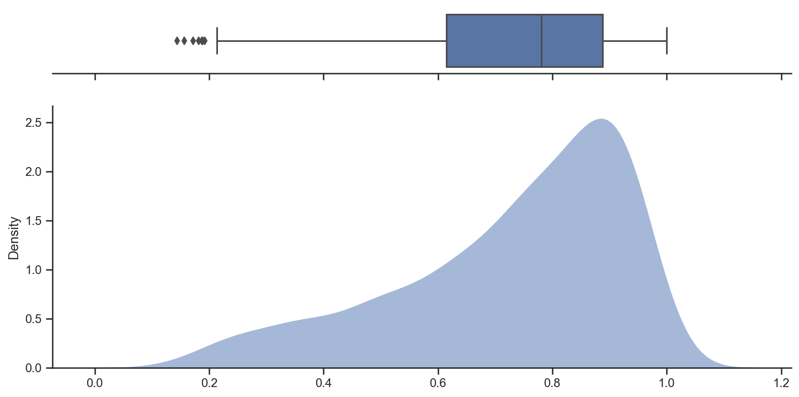

# Russian Show Analysis

General info

## Data

I've scraped information about top-1000 movies and top-1000 series in Russia.  

* **Movies**:
  * Info:
    * Dimensions: (984, 43)
    * Columns:
      * Show ID
      * Russian Title
      * Original Title
      * Actors and Voice Actors
      * Show Info (year, country, genre, slogan, director, scriptwriter, producer, operator, composer, artist, cut, budget, us box office, world box office, viewers, Russian box office, Russian premiere, world premiere, DVD release, blue ray release, age rating, MPAA rating, duration, digital release, marketing, platform, rerelease, film director)
      * rating kinopoisk, rating count kinopoisk, rating IMDB, rating count IMDB
      * synopsis
      * world critic's percentage, world critic's star value, world critic's number of reviews, Russian critic's percentage, Russian critic's number of reviews
  * Reviews:
    * Dimensions: (171094, 8)
    * Target class values: `good` (123379), `neutral` (26059), `bad` (21656)
    * Columns:
      * show ID
      * username
      * date and time
      * sentiment
      * subtitle
      * review body
      * usefulness ratio
      * direct link to the review
* **Series**:
  * Info:
    * Dimensions: (978, 43)
    * Columns: the same as in movies
  * Reviews:
    * Dimensions: (35643, 8)
    * Target class values: `good` (25540), `neutral` (5157), `bad` (4946)
    * Columns: the same as in movies

## Analysis

### [Research on the quality of localization of movie titles](https://github.com/Extremesarova/movie_reviews/blob/main/analysis/1_title_localization_analysis/movie_title_translation.ipynb)  

The goal of this research is to find out:

1) How similar Russian titles and original titles are in general?
2) Can we split dissimilar pairs (Russian title::original title) into groups by root cause?

**Results**:

1) In general, I can say that the titles are somewhat similar - the title similarity distribution is left-skewed.  

Average similarity is equal to 0.73 (median is 0.78)
2) There are a few cases for dissimilarity:  
    **Russian title is a cropped version of original title**  
    Another problem in this case can be the fact that embeddings don't work very well with proper names like Borat::Борат, Dolittle::Дулиттл, and so on.

    Examples:

    * Борат::Borat: Cultural Learnings of America for Make Benefit Glorious Nation of Kazakhstan
    * Веном 2::Venom: Let There Be Carnage
    * Бёрдмэн::Birdman or (The Unexpected Virtue of Ignorance)
    * Амели::Le Fabuleux destin d'Amélie Poulain

    **Russian title is an extended version of original title**  
    Remark about proper names applies to this case too.  
    Examples:
    * Удивительное путешествие доктора Дулиттла::Dolittle
    * Пол: Секретный материальчик::Paul
    * Рапунцель: Запутанная история::Tangled

    **Russian title was localized (made up) by translators/localizers**  
    Sometimes it is better to localize the title due to cultural and other peculiarities, but sometimes it goes too far.  
    Examples:
    * Невероятный мир глазами Энцо::The Art of Racing in the Rain
    * Человек, который изменил всё::Moneyball
    * Области тьмы::Limitless
    * Одинокий волк::Clean
